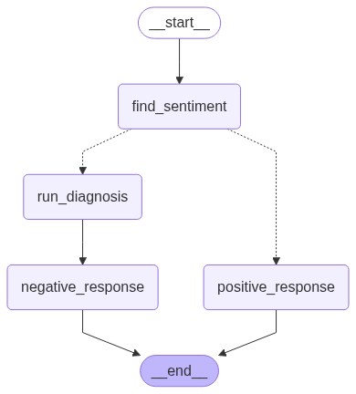

# 🛍️ Review Response Generator using LangGraph

This project uses **LangGraph**, **OpenAI GPT-4**, and **structured prompting** to generate empathetic, human-like responses to customer reviews — especially for e-commerce platforms like Amazon or Flipkart.

---

## 📌 Features

- 🔍 **Review Diagnosis**  
  Classifies customer reviews into:
  - Tone (e.g., frustrated, calm, appreciative)
  - Urgency (e.g., low, medium, high)
  - Issue Type (e.g., delivery, product quality, service)

- 🤖 **Dynamic Response Generation**  
  Generates personalized, empathetic replies based on the diagnosis.

- 🔗 **Call-to-Action Integration**  
  Adds a clickable link encouraging users to share more details with the seller.

- 🔄 **LangGraph Workflow**  
  Modular and flexible pipeline using LangGraph `StateGraph` and function-based nodes.

---

## 🧠 How It Works

1. **Input:** A customer review (text)
2. **Diagnosis Node:** Uses an LLM to identify tone, urgency, and issue type
3. **Branching:**  
   - Positive → `positive_response()`  
   - Negative → `negative_response()`
4. **Response Node:** Generates a seller-like reply using OpenAI
5. **Output:** A concise, empathetic message ready for reply or email

---

### 🧭 LangGraph Workflow Diagram



## 🚀 Quick Start

1. **Clone the repo**
   ```bash
   git clone https://github.com/bantee-sharma/review-response-generator.git
   cd review-response-generator


